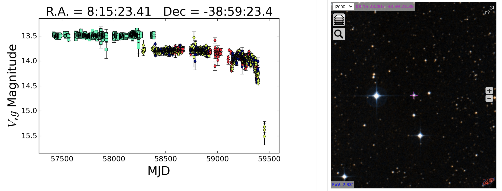
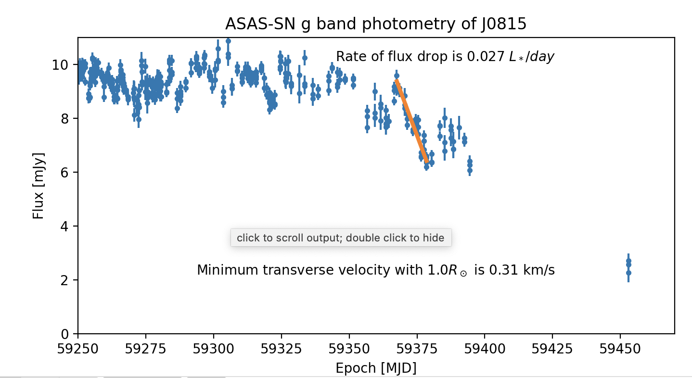

# ASASSN-21qj: A Rapidly Fading, Sun-Like Star

[ATel #14879 on discovery](https://www.astronomerstelegram.org/?read=14879) M. Rizzo Smith, T. Jayasinghe, K. Z. Stanek, C. S. Kochanek, et al.

M. Kenworthy experimenting with the light curve

RA, Dec

8:15:23.41 -38:59:23.4

"Gaia EDR3 source 5539970601632026752 at RA=08:15:23.2996, DEC=-38:59:23.304, d~556 pc, G=13.4 mag, BP-RP=0.8 mag) is classified as a Sun-like star in the Gaia DR catalog (R=1.03 R_Sun; L=1.1 L_Sun).

ASASSN-21qj was at g~14.2 before becoming Sun constrained on UT 2021-06-29. When the star was again observable on UT 2021-08-26, it had dimmed significantly to g~15.3. As of UT 2021-08-27 ASASSN-21qj is at g~16.0 and appears to still be fading."

[Light curve from ASAS-SN](https://asas-sn.osu.edu/photometry?dec=-38.98983333333334&ra=123.84754166666666&radius=0.5)
and 
[Star in SIMBAD](http://vizier.u-strasbg.fr/viz-bin/VizieR-4?-c=123.84754166666666%20-38.98983333333334&-c.rs=5&-out.add=_r&-sort=_r)

| ID         | Right Ascension | Declination   | Epochs | Mean VMag | RMS   |
| AP43691395 | 123.84697       | -38.98984     | 219    | 13.47     | 0.013 |

